# 📊 Database Project – Client Management System (Access)

This is a database application built using **Microsoft Access** to manage client information, service records, and billing data.

> 📄 **Full project documentation available here:**  
> [DOKUMENTACJA.docx](https://github.com/PawWoz/clinic-management-access/blob/main/BAZA-DANYCH-PRZYCHODNIA-kopia.docx)

---

## 🧠 Features

- Manage client records (CRUD)
- Track services and visits
- Generate billing reports
- Relational design with multiple connected tables
- Forms and queries for easy user interaction

---

## 🛠️ Tools & Technologies

- Microsoft Access (2021)
- Relational database design (1NF–3NF)
- SQL Queries
- VBA

---

## Some sample screenshots

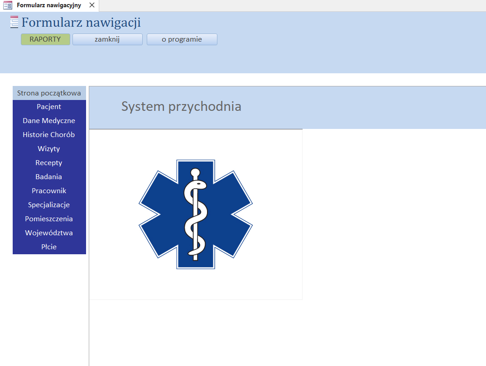
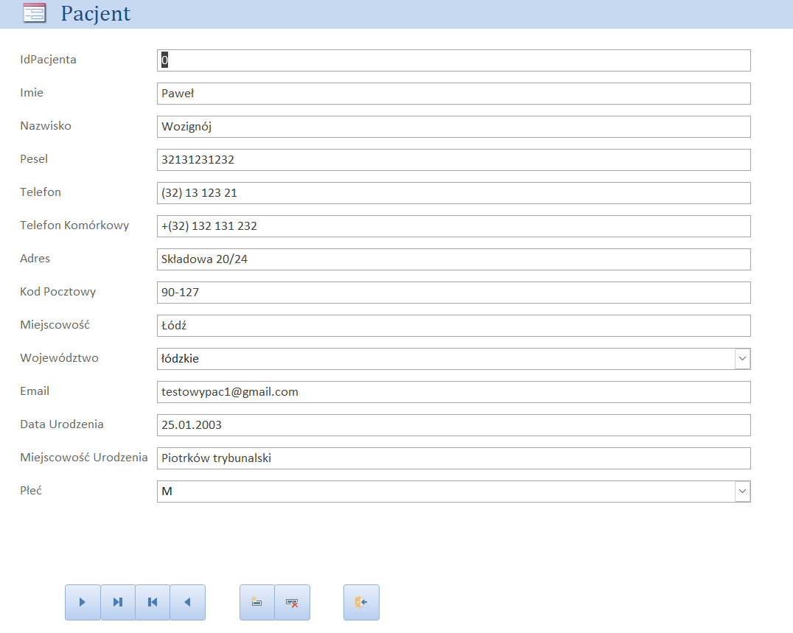
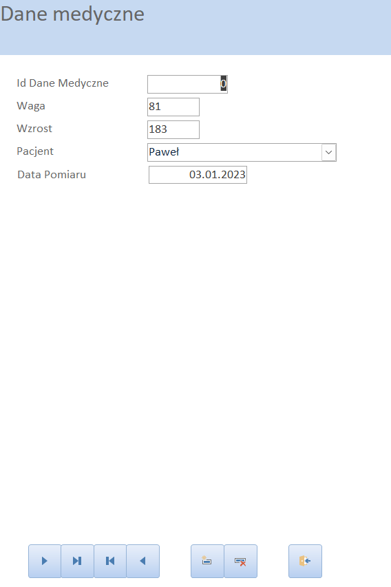
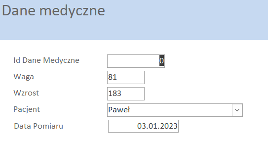
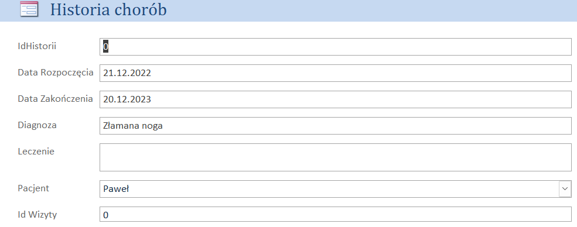
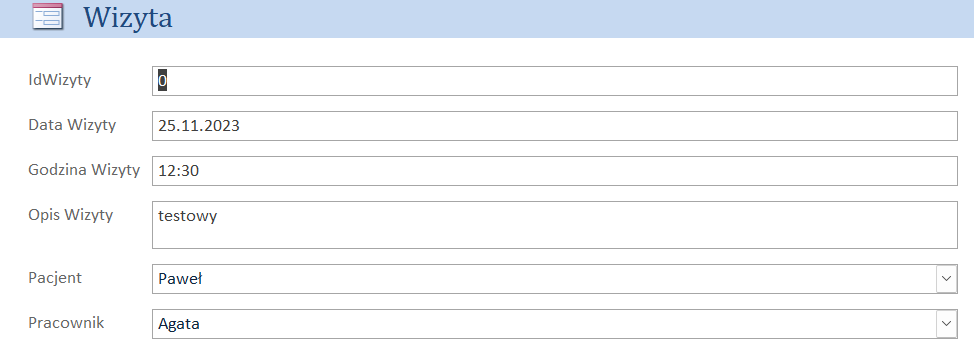
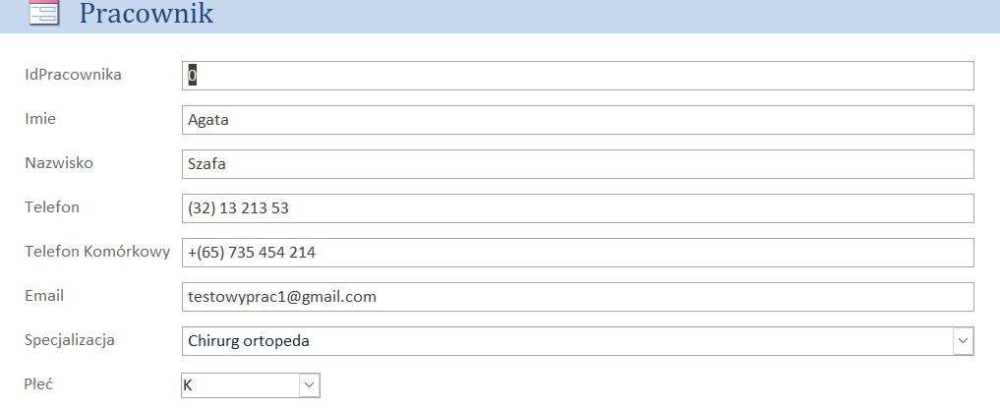
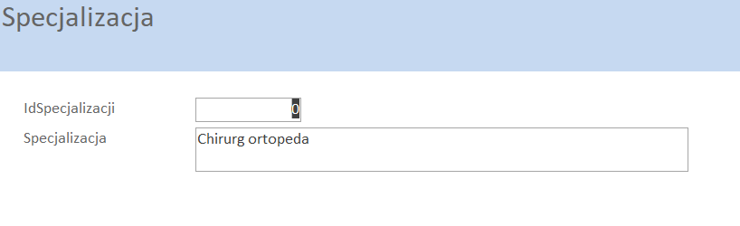
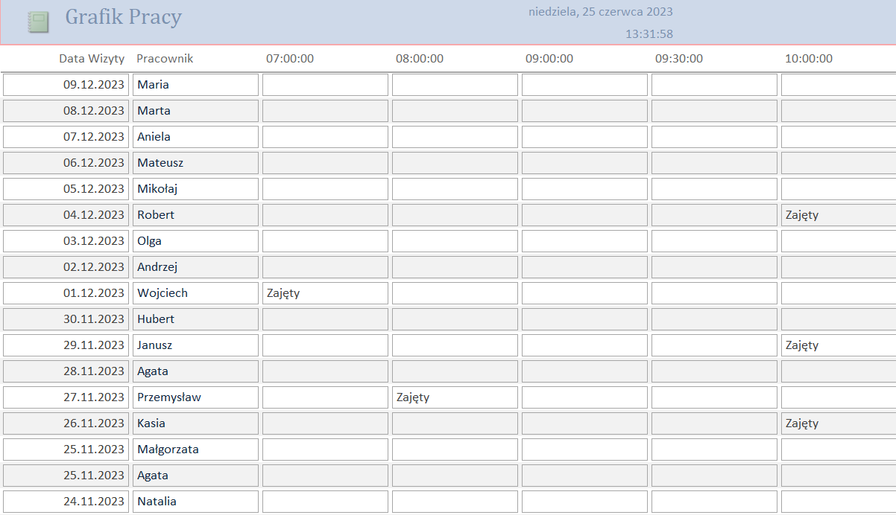
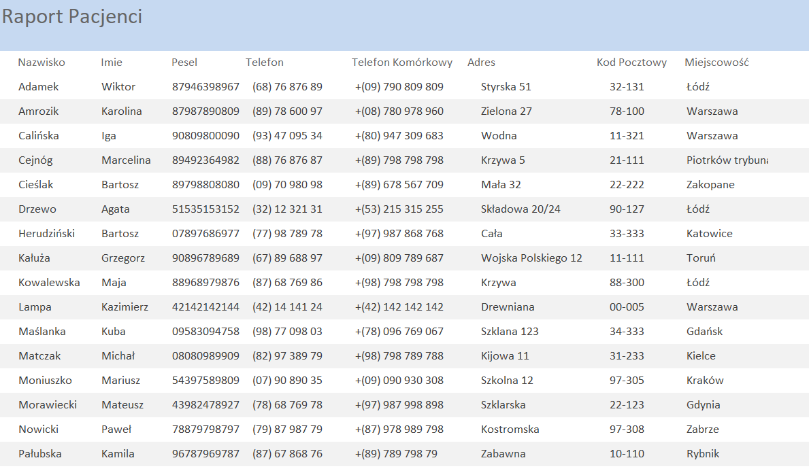
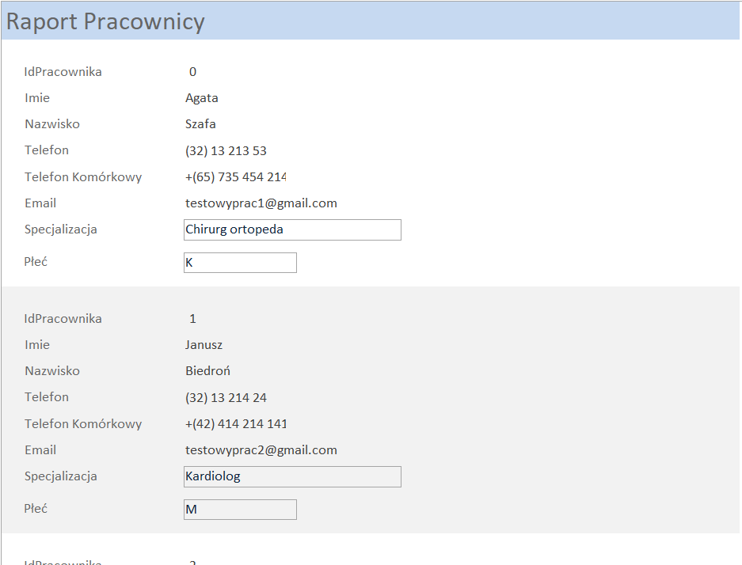
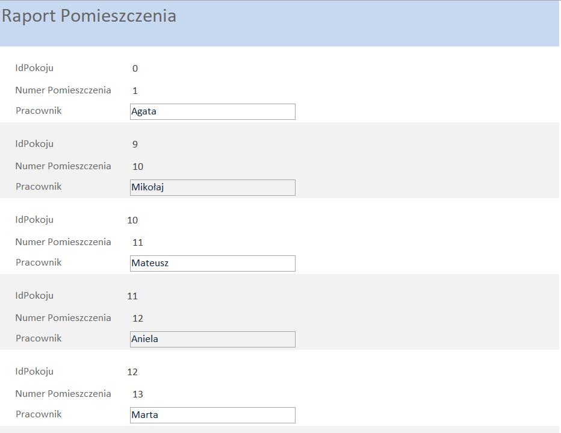
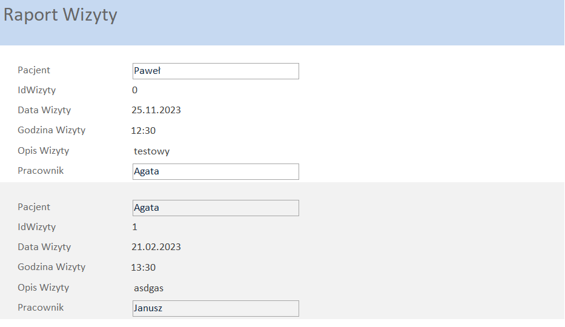
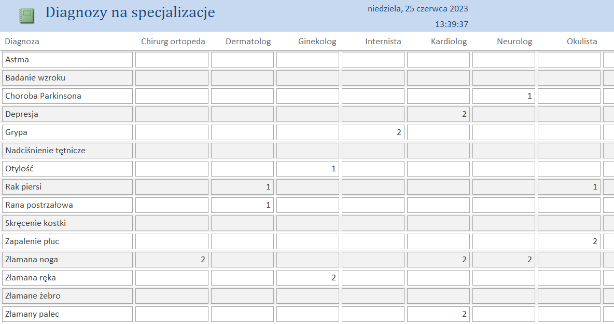
